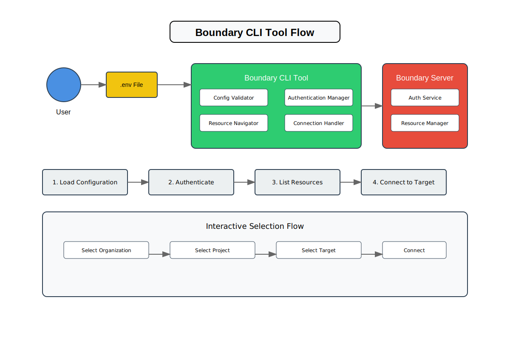

# Boundary Kubernetes Injector



A CLI tool to connect to HashiCorp Boundary targets with an interactive selection interface.

## Overview

This tool provides an interactive CLI interface for authenticating with HashiCorp Boundary and connecting to available targets. It simplifies the process of navigating through organizations, projects, and targets by providing a user-friendly selection menu.

## Features

- Interactive menu-driven interface
- Environmental configuration via `.env` file
- Automatic authentication with Boundary
- Hierarchical navigation through:
  - Organizations
  - Projects
  - Targets
- Integration with the Boundary CLI for connections
- Tabulated display of available resources

## Prerequisites

- Go 1.19 or later
- HashiCorp Boundary CLI installed and available in PATH
- Access to a Boundary server
- Proper authentication credentials

## Installation

1. Clone the repository:

```bash
git clone https://github.com/yourusername/boundary-kubernetes-injector.git
cd boundary-kubernetes-injector
```

2. Build the binary:

```bash
go build -o boundary-selector
```

## Configuration

Create a `.env` file in the project root with the following variables:

```env
BOUNDARY_ADDR=http://your-boundary-server:9200
BOUNDARY_LOGIN_NAME=your-login
BOUNDARY_AUTH_METHOD_ID=ampw_your_auth_method_id
BOUNDARY_PASSWORD=your-password
```

### Required Environment Variables:

- `BOUNDARY_ADDR`: The address of your Boundary server
- `BOUNDARY_LOGIN_NAME`: Your Boundary login username
- `BOUNDARY_AUTH_METHOD_ID`: The authentication method ID
- `BOUNDARY_PASSWORD`: Your Boundary password

## Usage

1. Ensure your `.env` file is properly configured
2. Run the tool:

```bash
./boundary-selector
```

3. Follow the interactive prompts to:
   - Select an organization
   - Choose a project
   - Pick a target
   - Connect to the selected target

## Program Flow

1. **Configuration Loading**

   - Loads environment variables from `.env`
   - Validates required configuration

2. **Authentication**

   - Authenticates with Boundary server
   - Stores authentication token

3. **Resource Selection**

   - Lists and displays available organizations
   - Shows projects within selected organization
   - Displays targets within selected project

4. **Connection**
   - Establishes connection to selected target
   - Displays connection information and credentials

## Code Structure

The code is organized into the following sections:

- **Types**: Data structures and type definitions
- **Configuration Management**: Environment loading and validation
- **Authentication**: Boundary authentication logic
- **Scope Operations**: Organization and project handling
- **Target Operations**: Target listing and connection
- **User Interface**: Interactive selection menus
- **Display Functions**: Output formatting and printing
- **Helper Functions**: Utility functions
- **Boundary CLI Integration**: CLI command execution
- **Main Flow**: Primary program flow control

## Error Handling

The tool includes comprehensive error handling for:

- Configuration issues
- Authentication failures
- API communication errors
- Resource selection problems
- Connection failures

## Dependencies

- `github.com/AlecAivazis/survey/v2`: Interactive prompts
- `github.com/hashicorp/boundary/api`: Boundary API client
- `github.com/joho/godotenv`: Environment file management

## Contributing

1. Fork the repository
2. Create your feature branch
3. Commit your changes
4. Push to the branch
5. Create a new Pull Request

## Acknowledgments

- HashiCorp for the Boundary project
- Contributors to the dependent packages

## Notes

- This tool requires direct access to your Boundary server
- Ensure your network allows communication with the Boundary server
- Keep your `.env` file secure and never commit it to version control
- Consider using a credentials manager for production environments
